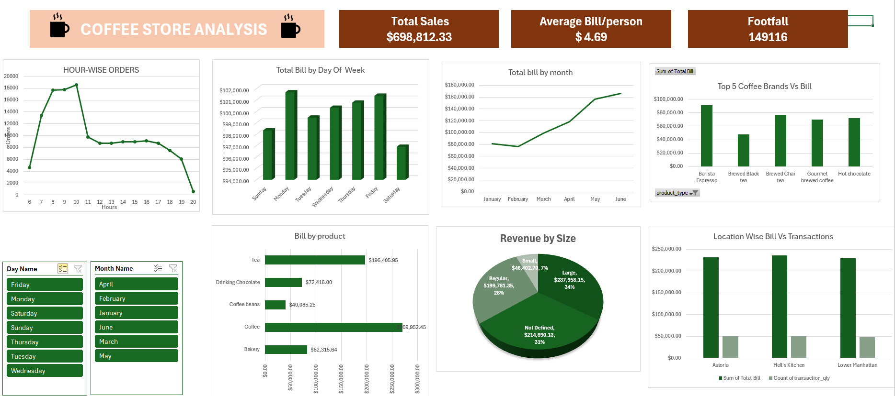

# Excel Data Analysis of Coffee Shop Stores

## Overview
This repository contains a comprehensive data analysis project focused on coffee shop stores. The analysis utilizes Microsoft Excel's Power Query, various chart types, slicers, and measures to provide insights into sales performance, customer preferences, and operational efficiency.

## Features
- **Power Query**: Streamlined data import and transformation processes.
- **Dynamic Charts**: Visual representations of sales trends, customer demographics, and product performance.
- **Slicers**: Interactive filters that allow users to explore data by different dimensions such as time, location, and product category.
- **Measures**: Calculated fields that provide deeper insights into key performance indicators (KPIs).

## Sample Dashboard

## Getting Started
1. Clone the repository.
2. Open the Excel file and enable macros if prompted.
3. Explore the dashboard and interact with the slicers to analyze the data.

## Contributing
Feel free to fork the repository and submit pull requests for any improvements or additional features.

## License
This project is licensed under the MIT License.
